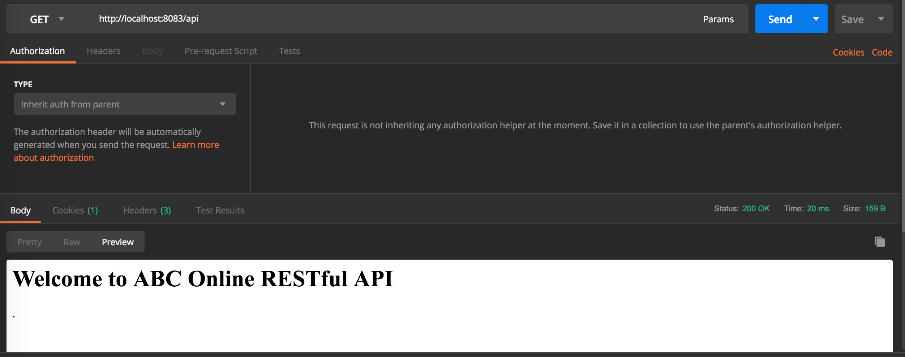

## ABC Online - RESTful API

#### Prerequisites

- MySQL should be installed. Current application tested with 8.0.1
- Java8 installed
- Gradle build tool installed. Current application tested with 4.8.1

### Running the application

- Clone repo from [here](https://github.com/Gogetter/abconline.git);
- Run sql script files located in  src/main/resources/sql_scripts, beginning with create_tables.sql;
- Change directory into cloned project directory
- Run `./gradlew bootRun` to start application. Application started at http://localhost:8083/api



### RESTful resources

#### Case Scenarios

1. Create a simple order management system for ABC online shop, where customer should be able to purchase items online
```http request
POST /api/orders/{orderId}/pay
```

2. The System should allow user to add items to a basket
```http request
POST /api/baskets/add/{customerId}
```

3. The System should allow user to delete items from a basket
```http request
DELETE /api/baskets/{basketId}/{customerId}
```

4. The System should allow user to create a new order
```http request
POST /api/orders/add/{customerId}
```

5. The System should be able to list all orders for a customer
```http request
GET /api/orders/{customerId}
```

6. The System should be able to fetch a specific order 
```http request
GET /api/orders/{ordersId}
```